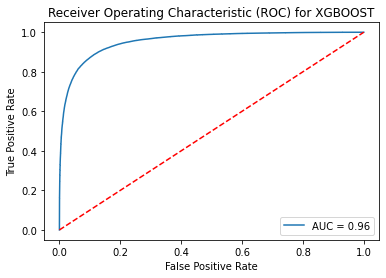
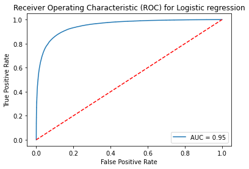
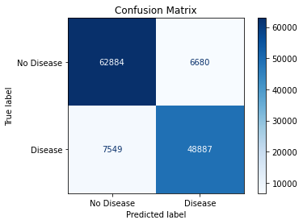
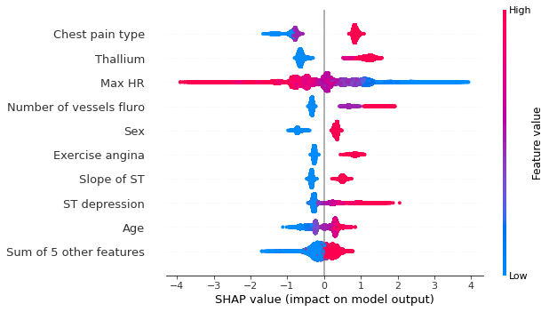
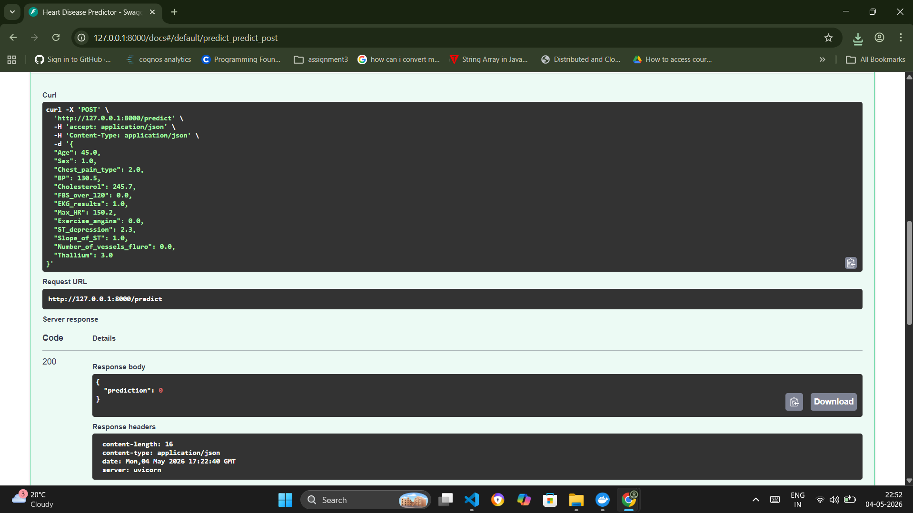
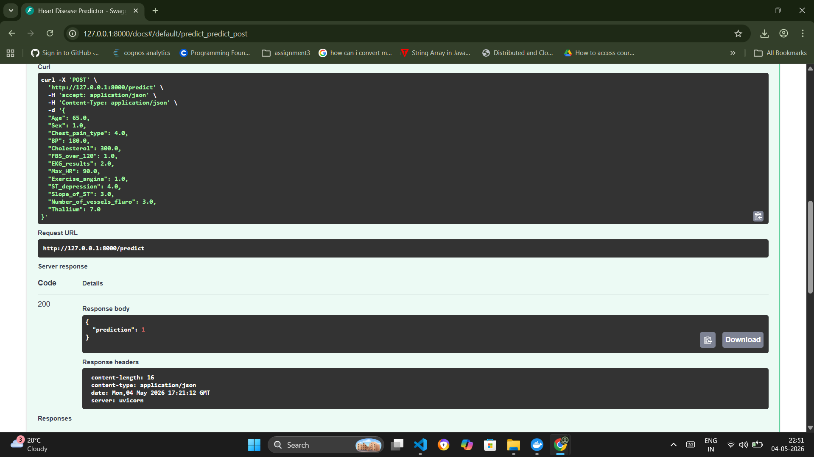

# Heart Disease Prediction API

This project is an end-to-end machine learning application built to predict the likelihood of heart disease using clinical patient data. The project compares Logistic Regression and XGBoost models, applies feature engineering techniques, and uses SHAP analysis to better understand how different clinical factors influence predictions.

I worked on this project as part of a Kaggle competition and focused not only on model performance, but also on interpretability and understanding the medical patterns within the data.

---

# Project Highlights

- Built and compared Logistic Regression and XGBoost models
- Performed feature engineering and skewness correction
- Used SHAP values to interpret model predictions
- Containerized the project using Docker
- Structured the project as a complete ML pipeline

---

# Model Performance

| Model | Accuracy | AUC Score |
| Logistic Regression | 88.4% | 0.94 |
| XGBoost | 88.7% | 0.95 |

XGBoost performed slightly better and was able to capture more complex non-linear relationships in the data.

---

# Feature Engineering

Some custom preprocessing and feature engineering steps included:

- Creating a risk indicator feature using Thallium and Maximum Heart Rate
- Applying log transformations to Cholesterol and ST Depression to reduce skewness
- Standardizing numerical variables such as Age, Blood Pressure, and Max Heart Rate

These steps improved both model stability and predictive performance.

---

# SHAP Interpretability Analysis

To better understand model behavior, SHAP was used to explain predictions and identify the most influential features.

Some important findings included:

- Thallium, Chest Pain Type, and Maximum Heart Rate had the strongest impact on predictions
- XGBoost captured more complex feature interactions than Logistic Regression
- A notable interaction was observed between Sex and Thallium levels

One interesting observation was that although women generally showed lower baseline risk, females with a reversible defect in the Thallium test showed a much stronger heart disease risk signal compared to males.

---
---

# Model Visualizations

## XGBoost ROC Curve



---

## Logistic Regression ROC Curve



---

## XGBoost Confusion Matrix



---

## Logistic Regression Confusion Matrix


---

## XGBoost SHAP Analysis



---

## Logistic Regression SHAP Analysis


---

# Sample Predictions

## Prediction Example - No Heart Disease



---

## Prediction Example - Heart Disease Detected


# Tech Stack

### Language
- Python
### Frameworks
- FastAPI (for model deployment API)

### Libraries
- Pandas
- NumPy
- Scikit-Learn
- XGBoost
- SHAP

### Visualization
- Matplotlib
- Seaborn

### Deployment
- Docker
- FastAPI

# Project Structure

```bash
Heart-Disease-Prediction-API/
│
├── api/
├── data/raw/
├── models/
├── notebooks/
├── src/
│
├── Dockerfile
├── requirements.txt
├── .gitignore
└── README.md
```

---

# Running the Project with Docker

## Build Docker Image

```bash
docker build -t heart-disease-api .
```

## Run the Container

```bash
docker run -p 5000:5000 heart-disease-api
```

---

# Future Improvements


- Create a frontend dashboard
- Deploy the model to cloud platforms
- Add CI/CD workflows using GitHub Actions

---

# About

This project was built to combine machine learning performance with interpretability and practical deployment. The goal was not only to predict heart disease accurately, but also to better understand the clinical patterns driving the predictions.
